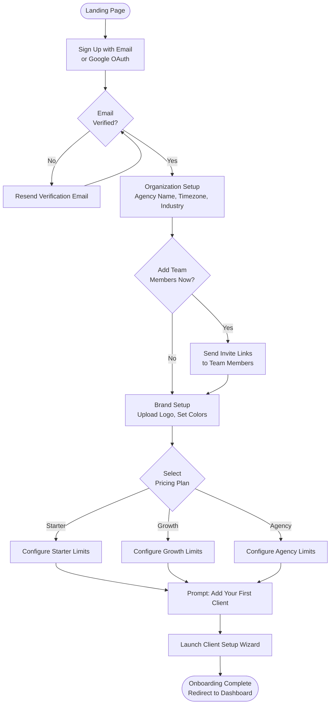
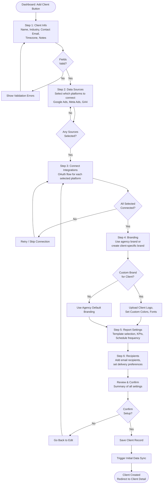
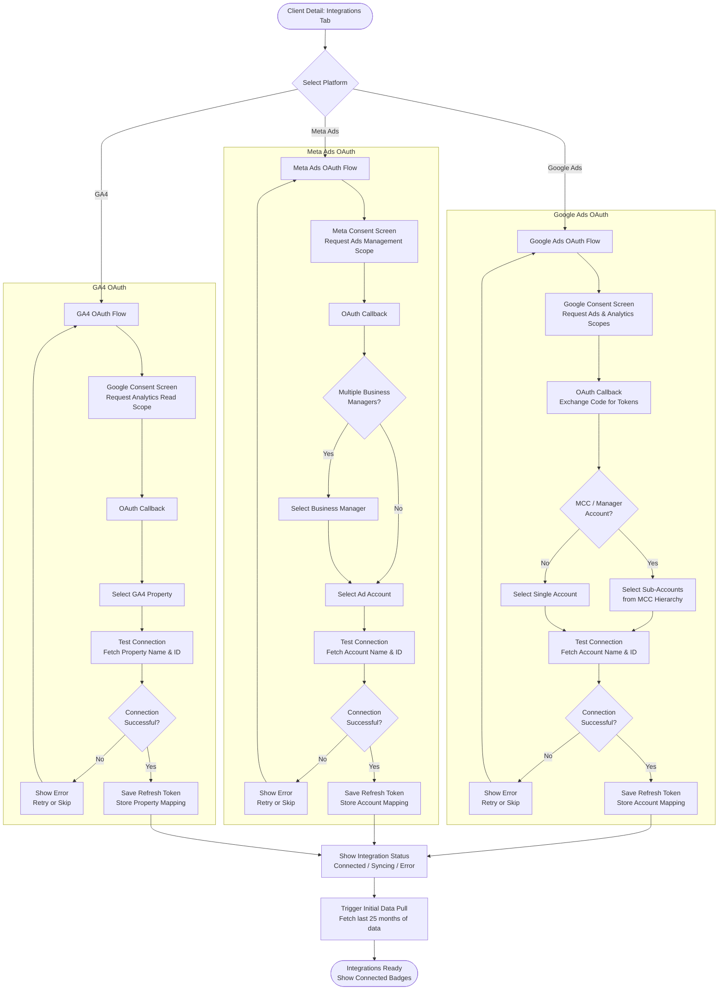
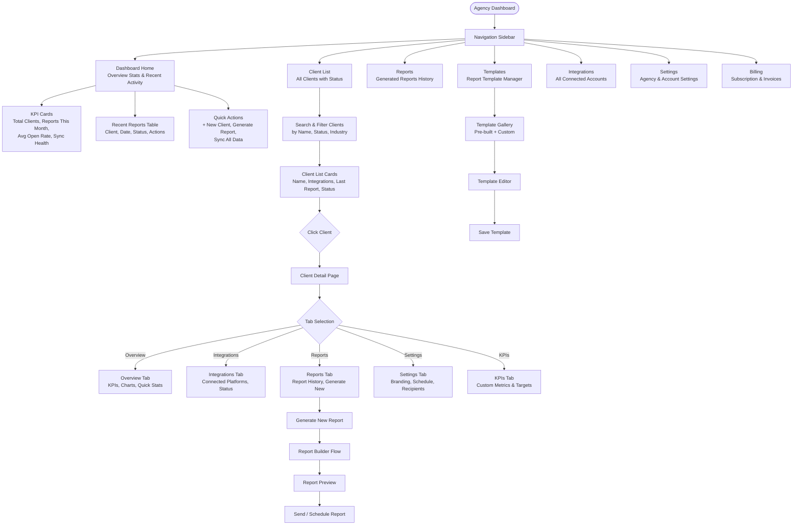
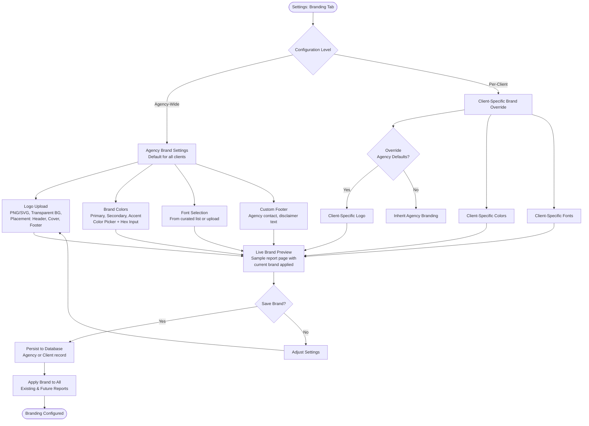
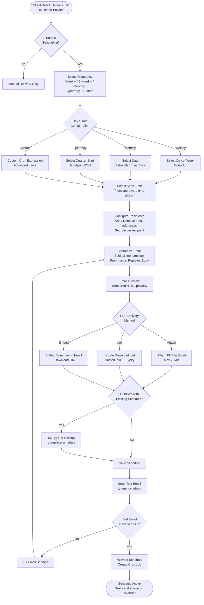
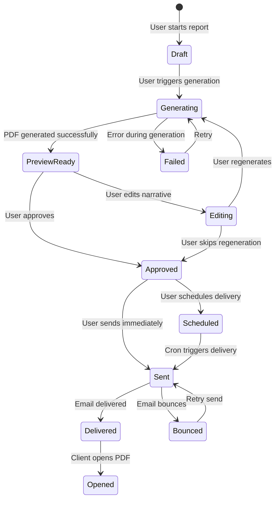

# AgencyPulse — App Flow Documentation

**Version:** 1.0
**Date:** 2026-09-06

This document describes all major user flows in AgencyPulse, represented as Mermaid flowcharts. Each flow covers a distinct user journey from entry point to completion.

---

## Table of Contents

1. [Agency Onboarding](#1-agency-onboarding)
2. [Client Setup Flow](#2-client-setup-flow)
3. [Integration Connection Flow](#3-integration-connection-flow)
4. [Dashboard Navigation](#4-dashboard-navigation)
5. [Report Generation Flow](#5-report-generation-flow)
6. [White-Label Configuration Flow](#6-white-label-configuration-flow)
7. [Scheduling Reports Flow](#7-scheduling-reports-flow)
8. [Billing Flow](#8-billing-flow)

---

## 1. Agency Onboarding

The onboarding flow guides a new agency from signup to their first connected integration.



**Key pages/screens:**
- Landing page with pricing preview
- Signup form (email/password or Google OAuth via Clerk)
- Email verification interstitial
- Organization setup form
- Team invitation modal
- Brand setup page (logo upload, color picker)
- Plan selection with feature comparison
- First-client prompt / empty state

**Exit conditions:** Agency reaches the dashboard with at least one client configured and at least one data integration connected.

---

## 2. Client Setup Flow

The client setup wizard is a multi-step form that collects everything needed to generate the first report for a new client.



**Key pages/screens:**
- Client info form (step 1 of wizard)
- Data source selection (step 2)
- OAuth connection modal per platform (step 3)
- Brand configuration (step 4)
- Report settings form (step 5)
- Recipients form (step 6)
- Review & confirm screen
- Success confirmation with "Generate First Report" CTA

---

## 3. Integration Connection Flow

Each third-party integration follows an OAuth 2.0 flow. This diagram covers the generic pattern, with notes for Google Ads, Meta Ads, and GA4 specifics.



**Key pages/screens:**
- Integrations tab on client detail page
- OAuth redirect to external provider
- Account/property selection dropdown
- Connection status indicator (connected, syncing, error, disconnected)
- Data freshness indicator ("Last synced 2 hours ago")

---

## 4. Dashboard Navigation

The main dashboard is the agency's command center. This flow covers the primary navigation paths.



**Key pages/screens:**
- Dashboard home with stat cards and recent activity
- Client list with search/filter
- Client detail page with tabbed navigation
- Navigation sidebar with active state indicator
- Top bar with notification bell, user menu, org switcher

---

## 5. Report Generation Flow

From trigger to delivery — the complete report lifecycle.

```mermaid
flowchart TD
 Start([Trigger Report Generation]) --> TriggerSource{Trigger Source}
 TriggerSource -->|Manual| ManualTrigger[Account Manager clicks<br/>"Generate Report"]
 TriggerSource -->|Scheduled| ScheduledTrigger[Cron Job triggers<br/>auto-generation]
 TriggerSource -->|Bulk| BulkTrigger[Bulk Generate<br/>for multiple clients]

 ManualTrigger --> ConfigReport[Report Configuration<br/>Client, Date Range, Template]
 ScheduledTrigger --> ConfigReport
 BulkTrigger --> ConfigReport

 ConfigReport --> FetchData[Data Fetching Layer<br/>Pull from connected integrations<br/>Google Ads, Meta, GA4]
 FetchData --> Normalize[Normalize Data<br/>Unified metric schema,<br/>time-aligned periods]
 Normalize --> Compute[Compute Derived Metrics<br/>CTR, CPA, ROAS, Trends,<br/>MoM/YoY Comparisons]
 Compute --> GenerateNarrative[AI Narrative Generation<br/>GPT-4o: Executive Summary,<br/>Channel Narratives, Recommendations]
 GenerateNarrative --> RenderCharts[Render Charts<br/>Recharts: Line, Bar, Area, Pie]
 RenderCharts --> BuildPDF[PDF Generation<br/>Puppeteer: Render HTML template<br/>to 300 DPI PDF]
 BuildPDF --> UploadPDF[Upload PDF to Storage<br/>Supabase Storage]
 UploadPDF --> Preview{Preview<br/>Mode?}
 Preview -->|Yes| ShowPreview[Open Report Preview<br/>In-Browser PDF Viewer]
 ShowPreview --> EditNarrative{Edit<br/>Narrative?}
 EditNarrative -->|Yes| NarrativeEditor[Inline Narrative Editor<br/>Edit summary, recommendations]
 NarrativeEditor --> Regenerate[Regenerate PDF with Edits]
 Regenerate --> UploadPDF
 EditNarrative -->|No| DeliveryChoice{Delivery<br/>Action?}
 Preview -->|No| DeliveryChoice
 DeliveryChoice -->|Send Now| SendEmail[Send via SendGrid<br/>Attach PDF, Use Email Template]
 DeliveryChoice -->|Schedule| ScheduleEmail[Add to Schedule<br/>Set Date, Frequency, Recipients]
 DeliveryChoice -->|Download| DownloadPDF[Download PDF<br/>to Local Machine]
 SendEmail --> TrackDelivery[Track Delivery<br/>Opens, Bounces, Clicks]
 ScheduleEmail --> TrackDelivery
 DownloadPDF --> Done([Report Complete])
 TrackDelivery --> Done
```

**Key pages/screens:**
- Report generation trigger button (client detail, bulk actions)
- Report configuration modal (date range, template, sections)
- Report preview page with in-browser PDF viewer
- Inline narrative editor (contenteditable sections)
- Delivery confirmation with tracking stats

---

## 6. White-Label Configuration Flow

Configuring agency-level and client-level branding.



**Key pages/screens:**
- Agency branding settings page
- Brand kit manager (save multiple presets)
- Color picker with live preview
- Logo upload with drag-and-drop
- Font selector with preview
- Live report preview panel
- Per-client brand override toggle

---

## 7. Scheduling Reports Flow

Setting up automated, recurring report delivery.



**Key pages/screens:**
- Schedule configuration panel (client settings)
- Frequency selector (visual cards for each option)
- Day/date configuration
- Timezone-aware time picker
- Recipients list with add/remove
- Email customization form
- Live email preview
- Schedule calendar view (upcoming sends)
- Schedule list with enable/disable toggle

---

## 8. Billing Flow

Subscription management and billing lifecycle.

```mermaid
flowchart TD
 Start([Settings: Billing Tab]) --> CurrentPlan[Current Plan Display<br/>Starter / Growth / Agency,<br/>Price, Renewal Date, Usage]
 CurrentPlan --> Action{Billing Action}
 Action -->|Upgrade| UpgradeFlow[Upgrade Plan Flow]
 Action -->|Downgrade| DowngradeFlow[Downgrade Plan Flow]
 Action -->|Cancel| CancelFlow[Cancellation Flow]
 Action -->|View History| History[Invoice History<br/>Download PDFs, Payment Method]

 subgraph UpgradeFlow [Upgrade Flow]
 UpgradeFlow --> ShowPlans[Show Available Plans<br/>with Feature Comparison]
 ShowPlans --> SelectPlan[Select New Plan]
 SelectPlan --> Prorate{Current Period<br/>Proration?}
 Prorate -->|Yes| CalculateProrated[Calculate Prorated Amount<br/>Credit remaining + new charge]
 Prorate -->|No| FullCharge[Full New Plan Charge]
 CalculateProrated --> ConfirmUpgrade[Confirm Upgrade<br/>Show amount to be charged]
 FullCharge --> ConfirmUpgrade
 ConfirmUpgrade --> ProcessPayment[Process Payment<br/>via Stripe]
 ProcessPayment --> PaymentOK{Payment<br/>Successful?}
 PaymentOK -->|Yes| UpdatePlan[Update Plan in DB<br/>Provision new limits]
 PaymentOK -->|No| PaymentError[Show Error<br/>Update payment method]
 PaymentError --> UpdatePayment[Update Card Details]
 UpdatePayment --> ProcessPayment
 UpdatePlan --> Success[Show Success Message<br/>New limits active immediately]
 end

 subgraph DowngradeFlow [Downgrade Flow]
 DowngradeFlow --> DowngradeWarning[Show Downgrade Warning<br/>Features that will be lost,<br/>data limits that apply]
 DowngradeWarning --> SelectDowngradePlan[Select Lower Plan]
 SelectDowngradePlan --> DowngradeConfirm[Confirm Downgrade]
 DowngradeConfirm --> ScheduleDowngrade[Schedule for End<br/>of Current Period]
 ScheduleDowngrade --> DowngradeDone([Downgrade Scheduled<br/>Effective next billing cycle])
 end

 subgraph CancelFlow [Cancellation Flow]
 CancelFlow --> CancelSurvey[Exit Survey<br/>Reason for leaving]
 CancelSurvey --> CancelConfirm[Final Confirmation<br/>Data export option]
 CancelConfirm --> CancelData{Keep Data?}
 CancelData -->|Yes| ArchiveData[Archive Data<br/>Read-only access for 30 days]
 CancelData -->|No| DeleteData[Schedule Data Deletion<br/>after 30-day grace period]
 ArchiveData --> CancelDone([Cancellation Confirmed<br/>Access until period end])
 DeleteData --> CancelDone
 end

 History --> DownloadInvoice[Download Invoice PDF]
 History --> UpdatePaymentMethod[Update Payment Method]

 Success --> Done([Billing Updated])
 DowngradeDone --> Done
 CancelDone --> Done
```

**Key pages/screens:**
- Billing overview page (current plan, usage, next invoice)
- Plan comparison table
- Upgrade confirmation modal
- Downgrade warning modal
- Cancellation survey
- Invoice list with download
- Payment method management

---

## Appendix: State Diagram for Report Status



## Appendix: Navigation Map

```
/ ──────────────────────────────────────────────
│ AgencyPulse │
├───────────────────────────────────────────────┤
│ 🏠 Dashboard 📋 Clients 📊 Reports │
│ 📑 Templates 🔌 Integrations ⚙️ Settings│
│ 💳 Billing 👤 [User Menu] │
└───────────────────────────────────────────────┘

Dashboard (/dashboard)
├── KPI Overview Cards
├── Recent Reports Table
└── Quick Actions

Clients (/clients)
├── Client List (/clients)
│ ├── Search / Filter
│ └── Client Card → Client Detail (/clients/:id)
│ ├── Overview (/clients/:id)
│ ├── Integrations (/clients/:id/integrations)
│ ├── Reports (/clients/:id/reports)
│ ├── KPIs (/clients/:id/kpis)
│ └── Settings (/clients/:id/settings)
└── Add Client Wizard (/clients/new)

Reports (/reports)
├── Report History
└── Generate Report (/reports/new)

Templates (/templates)
├── Template Gallery
└── Template Editor (/templates/:id)

Settings
├── Agency Settings (/settings/agency)
├── Branding (/settings/branding)
├── Team (/settings/team)
└── Integrations (/settings/integrations)

Billing (/billing)
├── Current Plan
├── Usage
├── Invoices
└── Payment Method
```
