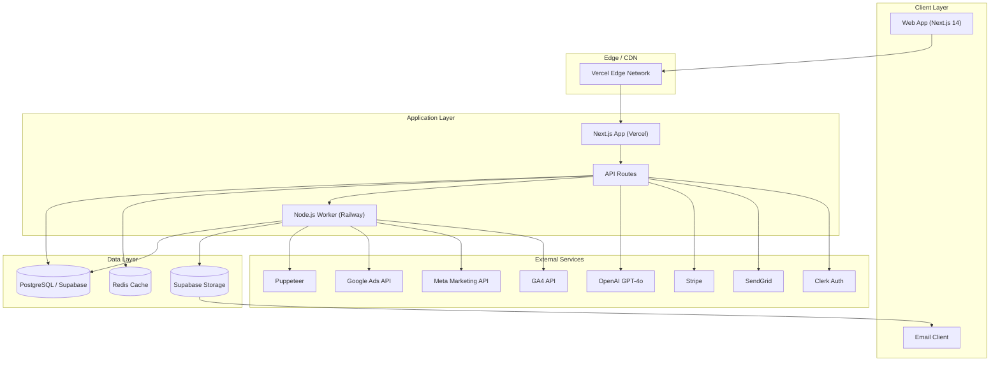

# AgencyPulse — Technical Requirements Document (TRD)

**Version:** 1.0 
**Date:** 2026-09-06 
**Status:** Draft 

---

## 1. Technical Overview & Architecture

AgencyPulse is an AI-powered client reporting platform for digital marketing agencies. It aggregates performance data from multiple advertising and analytics platforms, generates branded PDF reports with AI-written insights, and provides agency administrators with dashboards, scheduling, and client management tools.

### 1.1 High-Level Goals

- Aggregate siloed campaign data (Google Ads, Meta, GA4) into unified agency dashboards.
- Auto-generate human-readable narrative insights using LLM integration.
- Produce branded, PDF-ready reports on a schedule with one click.
- Support multi-tenant agency isolation with role-based access control.
- Handle 500 agencies and 5,000 clients with sub-second report generation.

### 1.2 Core Modules

| Module | Responsibility |
|---|---|
| **Auth & Identity** | Authentication, organization management, role-based access. |
| **Dashboard** | KPI overview, trend charts, metric comparison widgets. |
| **Report Builder** | Report configuration, template selection, scheduled delivery. |
| **Data Ingestion** | OAuth token management, periodic data sync from third-party APIs. |
| **AI Narrative Engine** | GPT-4o prompt orchestration, insight generation, tone control. |
| **PDF Generation** | Report rendering via Puppeteer, branded template execution. |
| **Billing** | Subscription management, usage-based billing, invoice generation. |
| **Notifications** | Email delivery via SendGrid, webhook callbacks. |

---

## 2. Technology Stack

### 2.1 Frontend

| Technology | Purpose |
|---|---|
| **Next.js 14 (App Router)** | React meta-framework for SSR, RSC, and API routes. |
| **React 18** | UI component library. |
| **TypeScript** | Type-safe application logic. |
| **Tailwind CSS** | Utility-first CSS framework. |
| **shadcn/ui** | Accessible, composable component primitives (Radix + Tailwind). |
| **Recharts** | Data visualization — line, bar, area, pie, and custom charts. |
| **TanStack Query (React Query)** | Server-state management, caching, background refetching. |
| **Zustand** | Lightweight client-side state management. |
| **React Hook Form + Zod** | Form handling and schema validation. |
| **date-fns** | Date manipulation and formatting. |

### 2.2 Backend

| Technology | Purpose |
|---|---|
| **Next.js API Routes** | Primary API layer (REST endpoints, auth middleware). |
| **Node.js Microservice** | Dedicated worker for long-running tasks (PDF generation, bulk sync). |
| **tRPC (optional)** | End-to-end type-safe API calls from frontend to API routes. |

### 2.3 Data Layer

| Technology | Purpose |
|---|---|
| **PostgreSQL (Supabase)** | Primary relational database. |
| **Redis** | Caching layer, rate limiting, job queue (BullMQ), session store. |
| **Supabase Storage** | S3-compatible object storage for generated PDF reports. |
| **Prisma** | ORM for database access and migrations. |

### 2.4 AI / ML

| Technology | Purpose |
|---|---|
| **OpenAI GPT-4o** | LLM for narrative generation, insights, and executive summaries. |
| **OpenAI Embeddings API** | Semantic search over historical reports and notes (future). |

### 2.5 Payments

| Technology | Purpose |
|---|---|
| **Stripe** | Subscription billing, invoicing, webhook handling. |

### 2.6 Auth

| Technology | Purpose |
|---|---|
| **Clerk** | Primary authentication (email, Google, SSO) and organization management. |
| **Supabase Auth** | Secondary auth for direct database access and RLS policies. |

### 2.7 Deployment

| Technology | Purpose |
|---|---|
| **Vercel** | Frontend hosting, Next.js edge functions, API routes. |
| **Railway** | Node.js microservice (PDF worker, background sync jobs). |
| **Supabase** | Hosted PostgreSQL, Redis-compatible (via Supabase), Storage. |

---

## 3. System Architecture



### 3.1 Data Flow — Report Generation

1. **Trigger** — Scheduled cron or manual button press via Next.js API route.
2. **Orchestration** — API route enqueues a job in Redis (BullMQ).
3. **Worker** — Node.js microservice dequeues job.
4. **Fetch** — Worker calls Google Ads, Meta, and GA4 APIs with stored OAuth tokens.
5. **Transform** — Raw API responses normalized to unified schema.
6. **AI Narrative** — Worker calls OpenAI GPT-4o with prompt containing KPI summaries.
7. **Render** — Puppeteer renders HTML template to PDF.
8. **Store** — PDF uploaded to Supabase Storage; metadata saved to PostgreSQL.
9. **Notify** — SendGrid email dispatched to recipient with PDF link.
10. **Cache** — Report metadata cached in Redis for fast dashboard retrieval.

---

## 4. API Design

### 4.1 REST API Endpoints (Next.js API Routes)

All endpoints are prefixed with `/api/v1` and require authentication via Clerk session tokens.

#### Auth

| Method | Path | Description |
|---|---|---|
| `POST` | `/api/v1/auth/register` | Register new agency (creates org + admin user). |
| `POST` | `/api/v1/auth/login` | Authenticate user (delegated to Clerk webhook). |
| `POST` | `/api/v1/auth/invite` | Invite team member to agency (admin only). |

#### Agencies

| Method | Path | Description |
|---|---|---|
| `GET` | `/api/v1/agencies/me` | Get current agency profile. |
| `PATCH` | `/api/v1/agencies/me` | Update agency settings. |
| `GET` | `/api/v1/agencies/:id/clients` | List clients for agency. |
| `POST` | `/api/v1/agencies/:id/clients` | Create new client. |

#### Clients

| Method | Path | Description |
|---|---|---|
| `GET` | `/api/v1/clients/:id` | Get client details + integrations. |
| `PATCH` | `/api/v1/clients/:id` | Update client info. |
| `DELETE` | `/api/v1/clients/:id` | Soft-delete client. |
| `POST` | `/api/v1/clients/:id/connect/:platform` | Initiate OAuth flow for ad platform. |
| `GET` | `/api/v1/clients/:id/integrations` | List connected platforms and token status. |

#### Reports

| Method | Path | Description |
|---|---|---|
| `GET` | `/api/v1/reports` | List reports (paginated, filtered by client/date). |
| `GET` | `/api/v1/reports/:id` | Get report detail + AI narrative. |
| `POST` | `/api/v1/reports` | Create report template/config. |
| `PATCH` | `/api/v1/reports/:id` | Update report template. |
| `DELETE` | `/api/v1/reports/:id` | Delete report template. |
| `POST` | `/api/v1/reports/:id/generate` | Trigger report generation (enqueues job). |
| `GET` | `/api/v1/reports/:id/download` | Get presigned download URL for PDF. |

#### Dashboards

| Method | Path | Description |
|---|---|---|
| `GET` | `/api/v1/dashboard/kpis` | Aggregated KPI data for dashboard widgets. |
| `GET` | `/api/v1/dashboard/trends` | Time-series data for chart rendering. |

#### Billing

| Method | Path | Description |
|---|---|---|
| `GET` | `/api/v1/billing/subscription` | Current plan and usage. |
| `POST` | `/api/v1/billing/checkout` | Create Stripe checkout session. |
| `POST` | `/api/v1/billing/webhook` | Stripe webhook handler. |

#### Webhooks

| Method | Path | Description |
|---|---|---|
| `POST` | `/api/v1/webhooks/clerk` | Clerk user/org sync events. |
| `POST` | `/api/v1/webhooks/sendgrid` | SendGrid delivery events. |

### 4.2 Internal Worker Endpoints (Node.js Microservice)

| Method | Path | Description |
|---|---|---|
| `POST` | `/internal/jobs/sync` | Trigger data sync for a client/platform. |
| `POST` | `/internal/jobs/generate-report` | Execute report generation job. |
| `GET` | `/internal/health` | Health check for Railway deployment. |

### 4.3 Response Format

All successful responses follow this envelope:

```json
{
 "success": true,
 "data": { ... },
 "meta": {
 "page": 1,
 "limit": 20,
 "total": 142
 }
}
```

Error responses:

```json
{
 "success": false,
 "error": {
 "code": "VALIDATION_ERROR",
 "message": "Invalid date range.",
 "details": { "field": "dateRange", "reason": "endDate must be after startDate" }
 }
}
```

### 4.4 Rate Limiting

- Authenticated API routes: 100 requests/minute per user.
- Unauthenticated routes: 20 requests/minute per IP.
- Long-running endpoints (`/generate`) use async job queues instead.

---

## 5. Scalability Requirements

### 5.1 Target Scale

| Metric | Target |
|---|---|
| Agencies | 500 |
| Total Clients | 5,000 |
| Reports per month | 50,000 |
| Peak concurrent users | 500 |
| Data points per report | 10,000–100,000 |
| PDF generation time target | < 30 seconds |

### 5.2 Multi-Tenancy Strategy

- **Row-Level Security (RLS)** in Supabase: every query scoped by `agency_id`.
- Separate Redis key namespaces per agency (`cache:{agency_id}:...`).
- Job queues partitioned by agency to prevent noisy-neighbor effects.
- Supabase Storage buckets organized per agency: `reports/{agency_id}/{client_id}/`.

### 5.3 Horizontal Scaling

- Next.js on Vercel auto-scales across edge regions.
- Node.js worker on Railway scales horizontally (multiple instances behind a queue).
- Redis BullMQ manages distributed job processing.
- Database read replicas via Supabase when query load exceeds threshold.

### 5.4 Database Capacity Planning

- Estimated tables: 25 (agencies, users, clients, integrations, reports, report_versions, etc.).
- Estimated rows at 5,000 clients / 500 agencies: ~2M rows across major tables.
- Supabase Pro plan supports up to 8TB; projected storage ~50GB.
- Connection pooling via Supabase's pgbouncer (default pool size: 15–50).

---

## 6. Security Requirements

### 6.1 Authentication & Authorization

- All API routes protected by Clerk session middleware.
- Organization-level role enforcement: `OWNER`, `ADMIN`, `EDITOR`, `VIEWER`.
- Resource ownership verified server-side (never trust client-supplied IDs).
- API tokens for third-party integrations (Google Ads, Meta, GA4) stored encrypted at rest using Supabase Vault or application-level AES-256 encryption.

### 6.2 Data Protection

- All data in transit enforced via TLS 1.3 (Vercel, Railway, Supabase default).
- Database columns containing secrets use `bytea` or encrypted `text` types.
- Supabase RLS policies enforce `agency_id` scoping on every table.
- CORS configured to allow only authorized origins.

### 6.3 Input Validation & Injection Prevention

- Zod schema validation on all API route inputs.
- Prisma parameterized queries (no raw SQL with user input).
- OpenAI prompts sanitized and scoped (no injection of untrusted data into ).
- Rate limiting and IP blocking for abusive patterns.

### 6.4 Audit Logging

- All authentication events logged (login, invite, role change).
- All data mutations logged with user ID, agency ID, timestamp, and diff.
- Stored in a dedicated `audit_logs` table (append-only, 90-day retention).

### 6.5 Secrets Management

- Third-party API keys and tokens stored in environment variables (Vercel / Railway).
- OAuth refresh tokens stored encrypted in database.
- No secrets in source code, `.env` files excluded from version control.

---

## 7. Performance Requirements

### 7.1 Frontend Performance

| Metric | Target |
|---|---|
| First Contentful Paint (FCP) | < 1.2s |
| Largest Contentful Paint (LCP) | < 2.5s |
| Time to Interactive (TTI) | < 3.5s |
| Cumulative Layout Shift (CLS) | < 0.1 |
| Lighthouse Performance Score | > 90 |

### 7.2 API Performance

| Metric | Target |
|---|---|
| API route response time (p95) | < 200ms |
| Dashboard data load (initial) | < 800ms |
| Report generation (enqueue to PDF ready) | < 30s |
| PDF download start | < 2s (presigned URL) |

### 7.3 Optimization Strategies

- Next.js Image component with automatic WebP/AVIF conversion.
- Route-level code splitting and dynamic imports for heavy components.
- Recharts charts memoized; data pre-aggregated in API layer.
- Redis caching for dashboard KPIs (TTL: 5 minutes).
- Database indexes on `agency_id`, `client_id`, `created_at` across all tables.
- Supabase connection pooling and query optimization via Prisma.
- Puppeteer worker uses `--no-sandbox` with headless Chromium; report template precompiled.

---

## 8. Third-Party Integrations

### 8.1 Google Ads API

- **Purpose:** Pull campaign performance, spend, impressions, clicks, conversions.
- **Auth:** OAuth 2.0 (offline access, refresh token rotation).
- **Rate Limits:** 15,000 queries/day per developer token; respect per-customer limits.
- **Sync Frequency:** Every 4 hours via cron; real-time on-demand for manual reports.
- **Data Stored:** Normalized daily snapshots in `campaign_metrics` table.

### 8.2 Meta Marketing API

- **Purpose:** Pull ad account performance (spend, impressions, clicks, ROAS).
- **Auth:** OAuth 2.0 with long-lived tokens.
- **Rate Limits:** 200 calls/hour per ad account (batching via Batch API).
- **Sync Frequency:** Every 4 hours.
- **Data Stored:** Daily snapshots in `campaign_metrics`.

### 8.3 GA4 (Google Analytics 4) API

- **Purpose:** Pull website traffic, sessions, conversions, user engagement.
- **Auth:** Service account (JWT) or OAuth 2.0.
- **Rate Limits:** 50,000 requests/day per project.
- **Sync Frequency:** Every 6 hours.
- **Data Stored:** Daily snapshots in `ga4_metrics` table.

### 8.4 OpenAI GPT-4o

- **Purpose:** Generate narrative insights for reports.
- **Auth:** API key.
- **Rate Limits:** Token-based rate limits per tier.
- **Prompt Strategy:** Structured with KPI data, tone parameters, and length constraints. Retry with exponential backoff (3 attempts).
- **Cost Control:** Token budgets per report (max 1,500 tokens output). Cached prompts for similar data patterns.

### 8.5 Stripe

- **Purpose:** Subscription billing, invoicing, payment method management.
- **Auth:** Secret key (server-side), publishable key (client-side).
- **Events:** `invoice.paid`, `invoice.payment_failed`, `customer.subscription.deleted`.
- **Sync:** Webhooks update `subscriptions` table in real-time.

### 8.6 SendGrid

- **Purpose:** Email delivery for report notifications, onboarding, billing.
- **Auth:** API key.
- **Templates:** Dynamic templates for report delivery, password reset, invites.
- **Rate Limits:** 100 emails/day free tier; scaled with plan.

### 8.7 Puppeteer

- **Purpose:** Render HTML report templates to PDF.
- **Environment:** Headless Chromium in Node.js worker (Railway).
- **Template:** Pre-built HTML with Tailwind CSS, rendered to A4/Letter PDF.
- **Optimization:** Single browser instance reused across jobs; templates cached in memory.

---

## 9. Browser Compatibility

| Browser | Minimum Version | Status |
|---|---|---|
| Chrome | 90+ | Fully supported |
| Edge | 90+ | Fully supported |
| Firefox | 88+ | Fully supported |
| Safari | 14+ | Fully supported |
| Mobile Safari (iOS) | 14+ | Supported |
| Chrome Mobile | 90+ | Supported |

### Notes

- CSS features: Grid, Flexbox, custom properties supported.
- `ResizeObserver` used for responsive charts (polyfilled for older browsers if needed).
- Recharts relies on SVG; all supported browsers render SVG correctly.
- No IE11 support planned.

---

## 10. Mobile Responsiveness

### 10.1 Breakpoints

| Breakpoint | Width | Layout |
|---|---|---|
| Mobile | < 640px | Single column, stacked cards, collapsible nav. |
| Tablet | 640px – 1024px | Two-column grid, sidebar collapsed to icons. |
| Desktop | > 1024px | Full sidebar, multi-column dashboards. |

### 10.2 Responsive Patterns

- Dashboard KPIs: 1 col (mobile) → 2 col (tablet) → 4 col (desktop).
- Charts: Full-width with touch-friendly tooltips (min tap target 44x44px).
- Report table: Card-based layout on mobile (each row becomes a card), horizontal scroll disabled.
- Navigation: Bottom tab bar on mobile (`< 640px`), sidebar on larger screens.
- Modals/Drawers: Full-screen on mobile, centered modal on desktop.

### 10.3 Performance on Mobile

- Code splitting ensures mobile payload < 200KB initial JS.
- Images served in WebP/AVIF with appropriate `sizes` attributes.
- Charts lazy-loaded with IntersectionObserver.

---

## 11. Disaster Recovery

### 11.1 Backup Strategy

| Component | Backup Method | Frequency | Retention |
|---|---|---|---|
| Supabase PostgreSQL | Automated daily backups (Supabase built-in) | Daily | 7 days (Pro plan) |
| Supabase Storage | Versioning enabled on buckets | Continuous | 30 days |
| Redis | AOF + RDB snapshots | Every 15 min | 24 hours |
| Environment Variables | Vercel + Railway encrypted backups | On change | N/A |

### 11.2 Recovery Time Objectives (RTO)

| Scenario | RTO | Recovery Steps |
|---|---|---|
| Database failure | < 4 hours | Restore from Supabase backup; point-in-time recovery available for Pro. |
| Application failure (Vercel) | < 1 hour | Redeploy from last known good commit. |
| Worker failure (Railway) | < 30 minutes | Railway auto-restarts; deploy new instance if needed. |
| Storage failure | < 2 hours | Supabase Storage redundant across regions (multi-region deployment). |

### 11.3 Zero-Downtime Deployment

- Vercel: Preview deployments, production promotion via Git.
- Railway: Rolling deployments with health checks.
- Database migrations via Prisma Migrate with `--create-only` + manual review before `migrate deploy`.

### 11.4 Data Retention Policy

- Raw API sync data: retained for 13 months (matches typical agency contract length).
- Generated PDFs: retained per client subscription tier (30–365 days).
- Audit logs: 90 days.
- Inactive agencies (> 6 months): archived to cold storage; data purged after 2 years.

---

## 12. Monitoring & Logging

### 12.1 Application Monitoring

| Tool | Purpose |
|---|---|
| **Vercel Analytics** | Frontend performance metrics (FCP, LCP, Web Vitals). |
| **Vercel Speed Insights** | Real-user monitoring (RUM) for Core Web Vitals. |
| **Sentry** | Error tracking and performance profiling for both Next.js and Node worker. |
| **Railway Metrics** | CPU, memory, network for worker service. |
| **Supabase Dashboard** | Database query performance, connection pool, storage usage. |
| **UptimeRobot / Checkly** | External uptime monitoring for health endpoints. |

### 12.2 Logging Strategy

- **Structured JSON logging** (Pino) in Next.js API routes and Node worker.
- Log levels: `debug`, `info`, `warn`, `error`.
- Sensitive data (tokens, PII) redacted before log output.
- Logs shipped to:
 - Vercel logs (for API routes).
 - Railway logs (for worker).
 - Optional: external log aggregation (Logflare, Datadog) for cross-service correlation.

### 12.3 Key Metrics to Monitor

| Metric | Alert Threshold |
|---|---|
| API error rate (5xx) | > 2% over 5 minutes |
| Job queue depth | > 100 pending jobs |
| PDF generation failure rate | > 5% |
| OpenAI API latency (p95) | > 10 seconds |
| Third-party API error rate | > 10% (per platform) |
| Stripe webhook failures | > 3 in 10 minutes |
| Database connection pool utilization | > 80% |
| Supabase storage remaining | < 20% of quota |
| Frontend JS bundle size | > 300KB (gzipped) |

### 12.4 Alerting Channels

- Critical (P0): PagerDuty / SMS via Vercel Alerts + Railway Alerts.
- High (P1): Slack channel `#agencypulse-alerts`.
- Medium (P2): Email digest to engineering team.
- Low (P3): Logged to monitoring dashboard, no immediate notification.

---

## Appendix A: Database Schema (Summary)

```sql
-- Agencies
agencies (id, name, domain, plan_id, created_at, updated_at)

-- Users (via Clerk, mirrored)
users (id, clerk_id, agency_id, email, role, created_at)

-- Clients
clients (id, agency_id, name, domain, timezone, created_at, updated_at)

-- Integrations
integrations (id, client_id, platform, access_token, refresh_token, expires_at, status, created_at)

-- Campaign Metrics (partitioned by month)
campaign_metrics (id, integration_id, date, impressions, clicks, spend, conversions, ctr, cpc, created_at)

-- Reports
reports (id, agency_id, client_id, name, template_id, frequency, recipients, created_at, updated_at)

-- Report Versions
report_versions (id, report_id, status, pdf_url, narrative, generated_at, created_at)

-- Subscriptions (Stripe)
subscriptions (id, agency_id, stripe_customer_id, plan, status, current_period_end, created_at)

-- Audit Logs
audit_logs (id, agency_id, user_id, action, resource_type, resource_id, diff, created_at)
```

## Appendix B: Environment Variables

| Variable | Service | Required |
|---|---|---|
| `NEXT_PUBLIC_CLERK_PUBLISHABLE_KEY` | Clerk | Yes |
| `CLERK_SECRET_KEY` | Clerk | Yes |
| `NEXT_PUBLIC_SUPABASE_URL` | Supabase | Yes |
| `NEXT_PUBLIC_SUPABASE_ANON_KEY` | Supabase | Yes |
| `SUPABASE_SERVICE_ROLE_KEY` | Supabase | Yes |
| `DATABASE_URL` | Supabase | Yes |
| `REDIS_URL` | Supabase / Redis | Yes |
| `OPENAI_API_KEY` | OpenAI | Yes |
| `STRIPE_SECRET_KEY` | Stripe | Yes |
| `STRIPE_WEBHOOK_SECRET` | Stripe | Yes |
| `NEXT_PUBLIC_STRIPE_PUBLISHABLE_KEY` | Stripe | Yes |
| `SENDGRID_API_KEY` | SendGrid | Yes |
| `GOOGLE_ADS_DEVELOPER_TOKEN` | Google Ads | Yes |
| `META_ACCESS_TOKEN` | Meta | Yes |
| `GA4_SERVICE_ACCOUNT_KEY` | GA4 | Yes (JSON key) |

## Appendix C: Glossary

| Term | Definition |
|---|---|
| Agency | Organization account that manages multiple client accounts. |
| Client | A brand or business whose ad campaigns are tracked and reported on. |
| Integration | A connected third-party platform (Google Ads, Meta, GA4) for a specific client. |
| Report Template | A configurable blueprint defining which metrics, charts, and narrative sections appear in a report. |
| Report Version | A single generated instance of a report (one PDF + narrative at a specific point in time). |
| Worker | The Node.js microservice handling long-running tasks (PDF generation, bulk data sync). |
